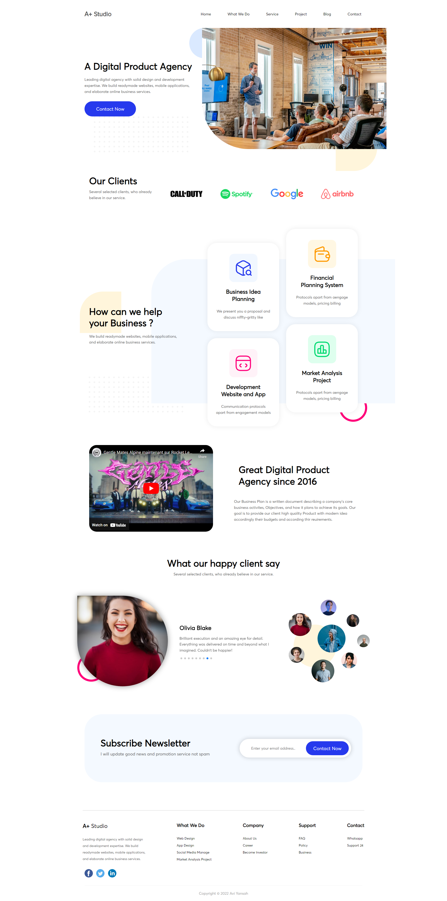

<h1 align="center"> 🌟 APLUS STUDIO 🌟 </h1>

### 🌐 Demo / Preview


---

### ✏️ **Description**
APLUS STUDIO is the most advanced full front-end project I have completed, combining everything I’ve learned so far and requiring a level of precision and creativity beyond 100%.  

The original Figma design was only available in desktop view, meaning I **designed and created all responsive versions** from scratch. This additional challenge demanded a strong focus on creativity, adaptability, and design thinking.

This project is not part of the official beCode curriculum but was undertaken as an extra challenge to push my limits further.

### 💻 **Technologies Used**
- **HTML5**: For structuring the content.
- **SCSS**: For advanced styling and clean, maintainable code.
- **JavaScript**: For interactivity, including:
  - **Swiper.js**: Automatic sliders.
  - **LocalStorage**: To store form data locally.
  - **SweetAlert.js**: For beautiful alert popups.

### **Key Features** 🚀
🎨 **Responsive design**: Designed and implemented mobile and tablet versions from scratch.

🔄 **Automatic Swiper.js sliders**: Fully functional and dynamic sliders.

📋 **Interactive forms**: Data stored locally using LocalStorage.

💡 **SweetAlert.js integration**: Elegant and user-friendly alert popups.

💻 **Extra challenge**: Created outside of the standard beCode curriculum.

### 🛠️ **Installation & Usage**
1. Clone the repository:
   ```bash
   git clone https://github.com/HUYBERIC/APLUSSTUDIO.git
   cd APLUSSTUDIO
   ```

2. Open `index.html` in your favorite browser to view the project.

<br>
<br>
<br>

---

<h1 align="center"> 🌟 APLUS STUDIO 🌟 </h1>

---

### ✏️ **Description**
APLUS STUDIO est le projet front-end le plus avancé que j’ai réalisé, combinant tout ce que j’ai appris jusque-là avec un niveau d’exigence et de créativité dépassant les 100 %.  

La maquette Figma initiale était uniquement en version desktop, ce qui signifie que j’ai **inventé et conçu toutes les versions responsives** du projet. Ce défi supplémentaire a nécessité un fort focus sur la créativité, l'adaptabilité et la réflexion en design.

Ce projet est un défi additionnel, non prévu dans le cadre officiel de la formation beCode, et réalisé pour aller au-delà des objectifs de base.

### 💻 **Technologies utilisées**
- **HTML5** : Pour structurer le contenu.
- **SCSS** : Pour un style avancé et un code propre et maintenable.
- **JavaScript** : Pour l’interactivité, incluant :
  - **Swiper.js** : Carrousels automatiques.
  - **LocalStorage** : Pour stocker les données des formulaires localement.
  - **SweetAlert.js** : Pour des alertes élégantes et conviviales.

### **Caractéristiques principales** 🚀
🎨 **Design responsive** : Versions mobile et tablette inventées et conçues à partir de zéro.

🔄 **Sliders automatiques avec Swiper.js** : Fonctionnels et dynamiques.

📋 **Formulaires interactifs** : Données stockées localement grâce à LocalStorage.

💡 **Intégration de SweetAlert.js** : Popups élégantes et agréables pour l’utilisateur.

💻 **Défi supplémentaire** : Réalisé en dehors du cadre standard de la formation beCode.

### 🛠️ **Installation & Utilisation**
1. Cloner le dépôt :
   ```bash
   git clone https://github.com/HUYBERIC/APLUSSTUDIO.git
   cd APLUSSTUDIO
   ```

2. Ouvrir `index.html` dans votre navigateur favori pour voir le projet.
